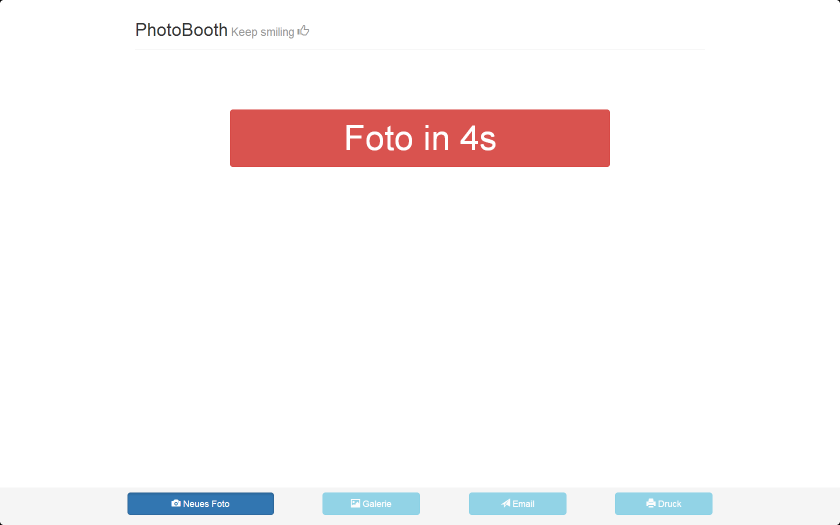
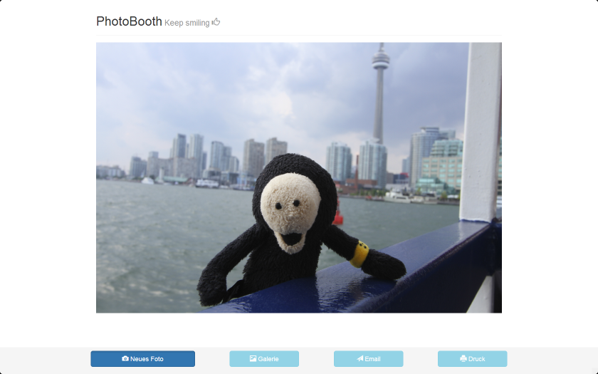

# node-raspbooth

A node.js powered Photobooth on a Raspberry Pi

Currently the script is under development. There is no readme for installation available at the moment. Below are some screenshots from the current script.

## Screenshots

Countdown until the photo is taken

Motivational message before the photo is taken

Display of the photo

